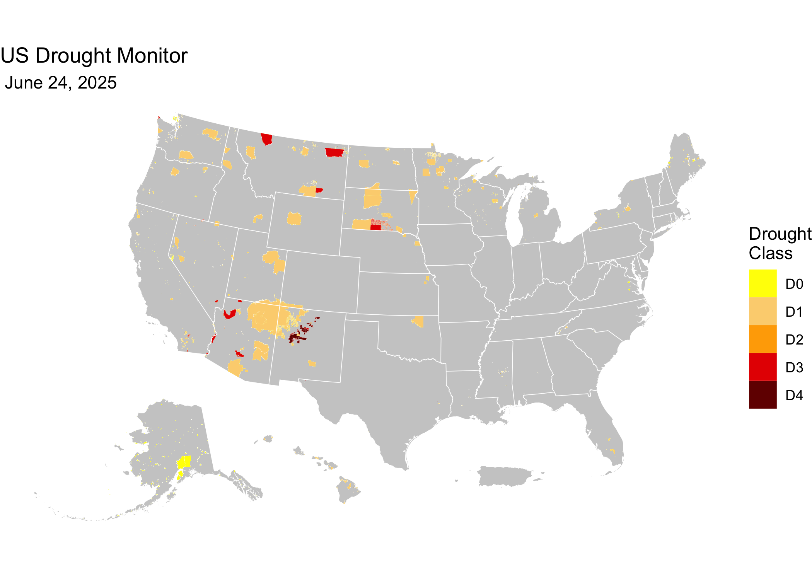

<!-- README.md is generated from README.Rmd. Please edit that file -->

[](https://github.com/native-resilience/usdm-aiannh/)


This repository provides weekly US Drought Monitor (USDM) data
aggregated to US Census American Indian/Alaska Native/Native Hawaiian
Area (AIANNH) boundaries. This dataset facilitates AIANNH-level analysis
of drought conditions, supporting research, policy-making, and climate
resilience planning.

<a href="https://native-resilience.github.io/usdm-aiannh/manifest.html" target="_blank">📂
View the US Drought Monitor AIANNH archive listing here.</a>

The goal of this repository is to aggregate AIANNH-level US Drought
Monitor data in a consistent and reproducible way, using authoritative
US Census AIANNH boundaries.

------------------------------------------------------------------------

## 📈 About the US Drought Monitor (USDM)

The US Drought Monitor is a weekly map-based product that synthesizes
multiple drought indicators into a single national assessment. It is
produced by:

- National Drought Mitigation Center (NDMC)
- US Department of Agriculture (USDA)
- National Oceanic and Atmospheric Administration (NOAA)

Each weekly map represents a combination of data analysis and expert
interpretation.

The USDM weekly maps depicting drought conditions are categorized into
six levels:

- **None**: Normal or wet conditions
- **D0**: Abnormally Dry
- **D1**: Moderate Drought
- **D2**: Severe Drought
- **D3**: Extreme Drought
- **D4**: Exceptional Drought

While USDM drought class boundaries are developed without regard to
political boundaries, it is often aggregated by political boundaries to
assist in decision-making and for regulatory purposes. **This repository
focuses on aggregating these data to the AIANNH level, enabling more
localized analysis and decision-making.**

> **Note**: This archive is maintained by the Montana Climate Office,
> but all analytical authorship of the USDM drought maps belongs to the
> named USDM authors.

------------------------------------------------------------------------

## 🗂 Directory Structure

- `usdm-aiannh.R`: R script that processes and aggregates weekly USDM
  shapefiles to AIANNH boundaries.
- `data/`: Directory containing processed AIANNH-level USDM data and US
  Census AIANNH boundary files.
- `README.Rmd`: This README file, providing an overview and usage
  instructions.
- `usdm-aiannh.parquet`: processed AIANNH-level USDM data.
- `census-aiannh-2024.parquet`: processed AIANNH boundaries from the US
  CENSUS

------------------------------------------------------------------------

## Data Sources

- **USDM Polygons**: Weekly `.parquet` files from
  [climate-smart-usda/usdm](https://github.com/climate-smart-usda/usdm)
- **U.S. Census AIANNH Boundaries**: Downloaded from the U.S. Census
  TIGER/Line archive for 2024.

All boundaries are reprojected to EPSG:4326, geospatially validated, and
saved in `.parquet` format.

## Processing Pipeline

The analysis pipeline is fully contained in
[`usdm-aiannh.R`](usdm-aiannh.R) and proceeds as follows:

1.  **Install and load dependencies**:

- Uses `pak::pak()` to ensure fresh, source-built installs of critical
  geospatial packages.

2.  **Download AIANNH boundary shapefiles** for 2024 directly from US
    Census and store in `data/census`.

3.  **Convert the shapefile to (Geo)Parquet**:

- Extract and clean up attributes
- Encode using UTF-8, fix geometries, cast to MULTIPOLYGON, and
  calculate area
- Output is saved to `census-aiannh-2024.parquet`

4.  **Match USDM dates with appropriate AIANNH vintage**:

- Each USDM date is paired with the most recent AIANNH boundary file
  available for that year
- The full list of USDM dates is generated starting from `2000-01-04`,
  up to two days before the current date

5.  **Download and intersect**:

- For each weekly USDM `.parquet` file:
- Read AIANNH and drought geometries
- Perform spatial intersection
- Calculate the percent of each AIANNH area affected by each drought
  class
- Tabular output is saved to `data/usdm/USDM_{YYYY-MM-DD}.parquet`

6.  **Output Structure**: Each output file is a non-spatial `.parquet`
    file with the following fields:

- `GNIS`, `Name`, `NameLSAD`, `LSAD`, `CountyLSAD`
- `Date`: Date of the USDM map (weekly, on Tuesdays)
- `USDM Class`: One of `D0`, `D1`, `D2`, `D3`, `D4`
- `Total Area (m^2)`: Total area of the AIANNH
- `USDM Class Area (m^2)`: Area of the AIANNH in the USDM drought class
- `USDM Class Area (%)`: Percent of the AIANNH in this drought class
  (between 0 and 100)

------------------------------------------------------------------------

## 🛠️ Dependencies

Key R packages used:

- `sf`
- `terra`
- `arrow`
- `tidyverse`
- `curl`

The script installs all required packages using the
[`pak`](https://pak.r-lib.org) package.

------------------------------------------------------------------------

## 📍 Quick Start: Visualize a Weekly County USDM Map in R

This snippet shows how to load a weekly GeoParquet file from the archive
and create a simple drought classification map using `sf` and `ggplot2`.

``` r
# Load required libraries
library(arrow)
library(sf)
library(ggplot2) # For plotting
library(tigris)  # For state boundaries
library(rmapshaper) # For innerlines function

## Get latest USDM data
latest <-
  jsonlite::fromJSON(
    "manifest.json"
  )$path |>
  stringr::str_subset("parquet") |>
  max()
# e.g., [1] "data/usdm/USDM_2025-05-27.parquet"

date <-
  latest |>
  stringr::str_extract("\\d{4}-\\d{2}-\\d{2}") |>
  lubridate::as_date()

states <-
  tigris::states(cb = TRUE, 
                 resolution = "5m",
                 progress_bar = FALSE) |>
  dplyr::filter(!(STUSPS %in% c("MP", "VI", "AS", "GU"))) |>
  sf::st_cast("POLYGON", warn = FALSE, do_split = TRUE) |>
  tigris::shift_geometry()

# Get the highest (worst) drought class in each county
usdm <-
  latest |>
  arrow::read_parquet() |>
  dplyr::group_by(GNIS) |>
  dplyr::filter(`USDM Class` == max(`USDM Class`))

aiannh <- 
  tigris::native_areas(cb = TRUE, 
                       progress_bar = FALSE) |>
  sf::st_cast("POLYGON", warn = FALSE, do_split = TRUE) |>
  tigris::shift_geometry()

usdm_aiannh <-
  usdm |>
  dplyr::left_join(aiannh) |>
  sf::st_as_sf()
```

    ## Warning in dplyr::left_join(usdm, aiannh): Detected an unexpected many-to-many relationship between `x` and `y`.
    ## ℹ Row 1 of `x` matches multiple rows in `y`.
    ## ℹ Row 4 of `y` matches multiple rows in `x`.
    ## ℹ If a many-to-many relationship is expected, set `relationship =
    ##   "many-to-many"` to silence this warning.

``` r
# Plot the map
ggplot(states) +
  geom_sf(data = sf::st_union(states),
          fill = "grey80",
          color = NA) +
  geom_sf(data = usdm_aiannh,
          aes(fill = `USDM Class`), 
          color = "white",
          linewidth = 0.01) +
  geom_sf(data = states |>
            rmapshaper::ms_innerlines(),
          fill = NA,
          color = "white",
          linewidth = 0.2) +
  scale_fill_manual(
    values = c("#ffff00",
               "#fcd37f",
               "#ffaa00",
               "#e60000",
               "#730000"),
    drop = FALSE,
    name = "Drought\nClass") +
  labs(title = "US Drought Monitor",
       subtitle = format(date, " %B %d, %Y")) +
  theme_void()
```



------------------------------------------------------------------------

## 📝 Citation & Attribution

**Citation format** (suggested):

> Native Resilience Project. *US Drought Monitor weekly maps aggregated
> to US Census American Indian/Alaska Native/Native Hawaiian Area
> (AIANNH) boundaries*. Data curated and archived by R. Kyle Bocinsky,
> Montana Climate Office. Accessed via GitHub archive, YYYY.
> <https://native-resilience.github.io/usdm-aiannh/>

**Acknowledgments**:

- Map content by USDM authors.
- Data curation and archival structure by R. Kyle Bocinsky, Montana
  Climate Office, University of Montana.

------------------------------------------------------------------------

## 📄 License

- **Raw USDM data** (NDMC): Public Domain (17 USC § 105)
- **Processed data & scripts**: © R. Kyle Bocinsky, released under
  [CC0](https://creativecommons.org/publicdomain/zero/1.0/) and [MIT
  License](./LICENSE) as applicable

------------------------------------------------------------------------

## ⚠️ Disclaimer

This dataset is archived for research and educational use only. The
National Drought Mitigation Center hosts the US Drought Monitor. Please
visit <https://droughtmonitor.unl.edu>.

------------------------------------------------------------------------

## 👏 Acknowledgment

This project is part of:

**[*Native Resilience Project: Sustaining Water Resources and
Agriculture in a Changing
World*](https://www.ars.usda.gov/research/project/?accnNo=444612)**  
Supported by USDA NIFA and USDA Climate Hubs under grant number
2022-68015-36357 Prepared by the [Montana Climate
Office](https://climate.umt.edu)

------------------------------------------------------------------------

## 📬 Contact

**R. Kyle Bocinsky**  
Director of Climate Extension  
Montana Climate Office  
📧 <kyle.bocinsky@umontana.edu>  
🌐 <https://climate.umt.edu>
