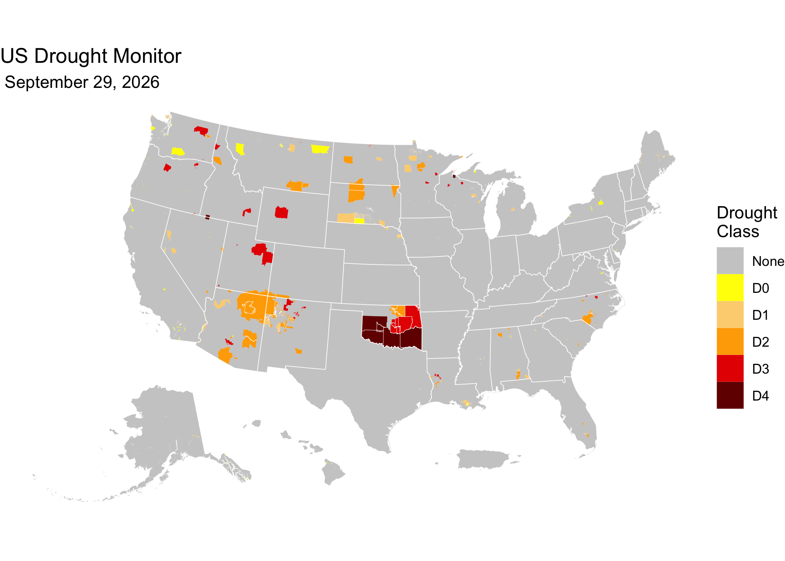

<!-- README.md is generated from README.Rmd. Please edit that file -->

[](https://github.com/native-resilience/usdm-aiannh/)


This repository provides weekly US Drought Monitor (USDM) data
aggregated to US Census American Indian/Alaska Native/Native Hawaiian
Area (AIANNH) boundaries. This dataset facilitates AIANNH-level analysis
of drought conditions, supporting research, policy-making, and climate
resilience planning.

<a href="https://native-resilience.github.io/usdm-aiannh/" target="_blank">🗺️
Open the Tribal Drought Dashboard</a>: the US Drought Monitor for any
week since 2000 on every AIANNH area, with drought history, the
overlapping counties’ drought classes, and reservations and
off-reservation trust lands reported separately.

<a href="https://data.native-resilience.com/usdm-aiannh/" target="_blank">📂
View the US Drought Monitor AIANNH archive listing here.</a>

The goal of this repository is to aggregate AIANNH-level US Drought
Monitor data in a consistent and reproducible way, using authoritative
US Census AIANNH boundaries.

------------------------------------------------------------------------

## 📈 About the US Drought Monitor (USDM)

The US Drought Monitor is a weekly map-based product that synthesizes
multiple drought indicators into a single national assessment. It is
produced by:

- National Drought Mitigation Center (NDMC)
- US Department of Agriculture (USDA)
- National Oceanic and Atmospheric Administration (NOAA)

Each weekly map represents a combination of data analysis and expert
interpretation.

The USDM weekly maps depicting drought conditions are categorized into
six levels:

- **None**: Normal or wet conditions
- **D0**: Abnormally Dry
- **D1**: Moderate Drought
- **D2**: Severe Drought
- **D3**: Extreme Drought
- **D4**: Exceptional Drought

While USDM drought class boundaries are developed without regard to
political boundaries, it is often aggregated by political boundaries to
assist in decision-making and for regulatory purposes. **This repository
focuses on aggregating these data to the AIANNH level, enabling more
localized analysis and decision-making.**

> **Note**: This archive is maintained by the Montana Climate Office,
> but all analytical authorship of the USDM drought maps belongs to the
> named USDM authors.

------------------------------------------------------------------------

## 🗂 Directory Structure

This repository holds the code; the data live in the public S3 bucket
`s3://native-resilience` (us-west-2) under `usdm-aiannh/`, served at
<https://data.native-resilience.com/usdm-aiannh/>.

**Code** (this repository):

- `usdm-aiannh.R`: R script that processes and aggregates weekly USDM
  polygons to AIANNH boundaries and publishes the archive.
- `R/s3-archive.R`: shared S3 archive helpers (vendored from
  [sustainable-fsa](https://github.com/sustainable-fsa)).
- `README.Rmd`: This README file, providing an overview and usage
  instructions.
- `docs/`: the [Tribal Drought
  Dashboard](https://native-resilience.github.io/usdm-aiannh/), a static
  page on the
  [mco-web-style](https://github.com/mt-climate-office/mco-web-style)
  kit, served by GitHub Pages.

**Data** (`https://data.native-resilience.com/usdm-aiannh/`):

- `data/usdm-aiannh/USDM_{YYYY-MM-DD}.parquet`: one table per weekly
  USDM map.
- `usdm-aiannh.parquet`: all weeks in a single table.
- `usdm-aiannh.json`: the worst drought class per AIANNH area per week,
  for web maps (also kept in this repository).
- `manifest.json`: every file under `data/` with its size;
  `_manifest.txt`: one download URL per line.
- `dashboard/areas.json` and `dashboard/{GEOID}.json`: the dashboard’s
  data — the current worst class for each area, and each component’s
  weekly cumulative percent of area at or above each class (D0–D4 … D4),
  like drought.gov’s county pages, plus the counties each component
  overlaps (share of the component in each) with each county’s weekly
  worst class from
  [usdm-counties](https://github.com/sustainable-fsa/usdm-counties).
- `dashboard/mask.geojson`: everything outside the Tribal areas, which
  the dashboard draws over the weekly USDM map (from
  [data-tiles](https://github.com/sustainable-fsa/data-tiles)) to fade
  it.

The AIANNH boundaries themselves are not copied here; they live in the
[`census-aiannh`](https://github.com/sustainable-fsa/census-aiannh)
archive at <https://data.sustainable-fsa.com/census-aiannh/>.

------------------------------------------------------------------------

## 💾 Accessing the Data

No credentials are needed. Browse the archive at
<https://data.native-resilience.com/usdm-aiannh/>, or:

``` bash
aws s3 ls s3://native-resilience/usdm-aiannh/ --no-sign-request
aws s3 sync s3://native-resilience/usdm-aiannh/data/usdm-aiannh/ ./usdm-aiannh --no-sign-request
```

``` r
# All weeks, one table
arrow::read_parquet("https://data.native-resilience.com/usdm-aiannh/usdm-aiannh.parquet")

# Or query the archive in place with DuckDB
con <- DBI::dbConnect(duckdb::duckdb())
DBI::dbExecute(con, "INSTALL httpfs; LOAD httpfs;")
DBI::dbGetQuery(con, "
  SELECT GEOID, NameLSAD, usdm_date, usdm_class, usdm_percent
  FROM read_parquet('https://data.native-resilience.com/usdm-aiannh/usdm-aiannh.parquet')
  WHERE AIANNHCE = '2430'  -- Navajo Nation (reservation and trust land)
  ORDER BY usdm_date DESC, GEOID, usdm_class
  LIMIT 12")
```

------------------------------------------------------------------------

## Data Sources

- **USDM Polygons**: Weekly `.parquet` files from
  [sustainable-fsa/usdm](https://github.com/sustainable-fsa/usdm) — the
  coastline-clipped product, in which the classes `D0`–`D4` are mutually
  exclusive.
- **U.S. Census AIANNH Boundaries**: full-resolution TIGER/Line files,
  unclipped and as published, from the
  [`census-aiannh`](https://github.com/sustainable-fsa/census-aiannh)
  archive (`data/parquet/{year}-aiannh.parquet`), which owns the
  downloads, the per-vintage schema normalization and the validity
  repair. Vintages 2000 and 2007 onward are available.
- For each USDM date, the **boundary vintage used is the TIGER/Line file
  for the previous year**, the same rule as
  [`usdm-counties`](https://github.com/sustainable-fsa/usdm-counties);
  years without a vintage use the most recent earlier one:

| USDM year | AIANNH vintage (`census_year`) |
|-----------|--------------------------------|
| 2000–2007 | 2000                           |
| 2008      | 2007                           |
| 2009      | 2008                           |
| …         | …                              |
| *Y*       | *Y* − 1                        |
| 2026      | 2025                           |

This aggregation follows the
[`usdm-counties`](https://github.com/sustainable-fsa/usdm-counties)
method, the reference for these archives, with two differences that make
the percentages more exact. The boundaries stay in their published NAD83
(EPSG:4269), and each week’s USDM layer is transformed to match them, so
every area is measured on the same geometry as the archive’s `Area`.
Areas are also measured directly on the s2 overlay output, without a
repair pass afterwards.

## Processing Pipeline

The analysis pipeline is fully contained in
[`usdm-aiannh.R`](usdm-aiannh.R) and proceeds as follows:

1.  **Pull the existing archive** from
    `s3://native-resilience/usdm-aiannh/`, so only new weeks are
    processed.

2.  **Fetch the vintage-matched AIANNH boundaries** from
    `census-aiannh`. Vintages are discovered from the archive, not
    hardcoded, so a new TIGER release needs no edit here. Each vintage
    is cached locally under `data-raw/census/{year}-aiannh.parquet`,
    because the intersections run in parallel across ~1,400 weeks.

3.  **Match each USDM date to its vintage**, using the table above. The
    list of USDM dates starts at `2000-01-04` and runs to two days
    before the current date.

4.  **Intersect**, for each weekly USDM `.parquet` file. This step runs
    on the sphere (s2):

- Intersect each AIANNH area with each drought class. The part of the
  area outside every class is the `None` class.
- Compute `usdm_percent` as the s2 geodesic area of each piece divided
  by the area’s full TIGER `Area`. Water inside a TIGER boundary is
  outside the coastline-clipped USDM map, so it counts toward `None`, as
  in `usdm-counties`.
- Check each week before it is written: every area in the vintage is
  present, it appears once per class, and its class percentages sum to 1
  within 1e-6.
- Save the table to `data/usdm-aiannh/USDM_{YYYY-MM-DD}.parquet`.

5.  **Output Structure**: each output file is a non-spatial `.parquet`
    file with one row per AIANNH area per drought class present. Its
    fields are:

- `GEOID`: Census AIANNH component id (`AIANNHCE` + `R`/`T`). TIGER
  splits some areas into a reservation (`R`) and off-reservation trust
  land (`T`); these remain separate rows here, as in `census-aiannh`
- `AIANNHCE`: Census AIANNH code, shared by an area’s components
- `GNIS`: GNIS identifier (`AIANNHNS`); empty in the 2000 and 2007
  vintages, where Census did not publish it
- `Name`, `NameLSAD`, `LSAD`: Census name, name with legal/statistical
  area description, and LSAD code
- `COMPTYP`: component type as published by Census (`R` or `T`)
- `census_year`: the TIGER/Line vintage these boundaries come from
- `usdm_date`: Date of the USDM map (weekly, on Tuesdays)
- `usdm_class`: Ordered factor, one of `None`, `D0`, `D1`, `D2`, `D3`,
  `D4`
- `usdm_percent`: Fraction of the component’s area in this drought class
  (between 0 and 1)

To get whole-area figures (reservation and trust land together), take a
weighted sum over components, using the `Area` column from the same
`census_year` vintage of `census-aiannh`:
`sum(usdm_percent * Area) / sum(Area)`, grouped by `AIANNHCE`,
`usdm_date` and `usdm_class`.

6.  **Consolidate and publish**: every weekly table is concatenated into
    `usdm-aiannh.parquet` and reduced to `usdm-aiannh.json` (below). New
    weekly files, the combined table, the JSON and the manifests are
    uploaded to S3 and verified. The README is then re-rendered from the
    published archive.

## 📤 Output Data

### `usdm-aiannh.json`

The same weekly records as the Parquet, reduced in the same run to the
worst drought class for each AIANNH component in each week, for direct
use in a browser. For analysis, use the Parquet.

- **One string per component**: each component’s history is one
  fixed-width string of class codes, from `0` (`None`) to `5` (`D4`).
  There is one character per weekly USDM Tuesday, on an implicit axis
  beginning 2000-01-04. A `.` marks a week in which the component is
  absent from that week’s boundary vintage.
- **Worst class, no threshold**: the maximum class over every record
  present. Any nonzero-area sliver counts.
- **Dictionary-coded names**: `geoids` and `names` (`NameLSAD` as of
  each component’s latest week) are arrays that run parallel to
  `series`.

The payload is self-describing via its `schema` field
(`usdm-max-class-aiannh/1`). It has the same layout as
`usdm-counties.json`’s `usdm-max-class/1`, with `geoids`/`names` in
place of the county arrays. It is a frozen contract: fields may be
added, but existing ones are never renamed or reordered without bumping
the schema.

------------------------------------------------------------------------

## 🛠️ Dependencies

Key R packages used:

- `sf`
- `arrow`
- `tidyverse`
- `furrr` / `future.mirai`
- `jsonlite`
- `processx` (with the AWS CLI v2, for publishing)

In GitHub Actions the environment comes from
[`mt-climate-office/actions/setup-geospatial`](https://github.com/mt-climate-office/actions).

------------------------------------------------------------------------

## 📍 Quick Start: Visualize a Weekly AIANNH USDM Map in R

This snippet shows how to load the latest weekly file from the archive
and create a simple drought classification map using `sf` and `ggplot2`.

``` r
# Load required libraries
library(arrow)
library(sf)
library(ggplot2) # For plotting
library(tigris)  # For state boundaries
library(rmapshaper) # For innerlines function

## Get latest USDM data
latest <-
  jsonlite::fromJSON(
    "https://data.native-resilience.com/usdm-aiannh/manifest.json"
  )$path |>
  stringr::str_subset("parquet") |>
  max()
# e.g., [1] "data/usdm-aiannh/USDM_2025-05-27.parquet"

date <-
  latest |>
  stringr::str_extract("\\d{4}-\\d{2}-\\d{2}") |>
  lubridate::as_date()

states <-
  tigris::states(cb = TRUE, 
                 resolution = "5m",
                 progress_bar = FALSE) |>
  dplyr::filter(!(STUSPS %in% c("MP", "VI", "AS", "GU"))) |>
  sf::st_cast("POLYGON", warn = FALSE, do_split = TRUE) |>
  tigris::shift_geometry()

# Get the highest (worst) drought class in each AIANNH area
usdm <-
  paste0("https://data.native-resilience.com/usdm-aiannh/", latest) |>
  arrow::read_parquet() |>
  dplyr::group_by(GEOID) |>
  dplyr::filter(usdm_class == max(usdm_class)) |>
  dplyr::ungroup()

# Simplified, latest-vintage AIANNH components from census-aiannh
aiannh <- 
  sf::read_sf("/vsicurl/https://data.sustainable-fsa.com/census-aiannh/census-aiannh_simple.fgb") |>
  dplyr::select(GEOID) |>
  sf::st_cast("POLYGON", warn = FALSE, do_split = TRUE) |>
  tigris::shift_geometry() |>
  dplyr::group_by(GEOID) |>
  dplyr::summarise() |>
  sf::st_cast("MULTIPOLYGON")

usdm_aiannh <-
  usdm |>
  dplyr::inner_join(aiannh, by = "GEOID") |>
  sf::st_as_sf()

# Plot the map
ggplot(states) +
  geom_sf(data = sf::st_union(states),
          fill = "grey80",
          color = NA) +
  geom_sf(data = usdm_aiannh,
          aes(fill = usdm_class), 
          color = "white",
          linewidth = 0.01) +
  geom_sf(data = rmapshaper::ms_innerlines(usdm_aiannh),
          fill = NA,
          color = "white",
          linewidth = 0.1) +
  geom_sf(data = states |>
            rmapshaper::ms_innerlines(),
          fill = NA,
          color = "white",
          linewidth = 0.2) +
  scale_fill_manual(
    values = c("grey80",
               "#ffff00",
               "#fcd37f",
               "#ffaa00",
               "#e60000",
               "#730000"),
    drop = FALSE,
    name = "Drought\nClass") +
  labs(title = "US Drought Monitor",
       subtitle = format(date, " %B %d, %Y")) +
  theme_void()
```



------------------------------------------------------------------------

## 📝 Citation & Attribution

**Citation format** (suggested):

> Native Resilience Project. *US Drought Monitor weekly maps aggregated
> to US Census American Indian/Alaska Native/Native Hawaiian Area
> (AIANNH) boundaries*. Data curated and archived by R. Kyle Bocinsky,
> Montana Climate Office. Accessed YYYY.
> <https://data.native-resilience.com/usdm-aiannh/>

**Acknowledgments**:

- Map content by USDM authors.
- Data curation and archival structure by R. Kyle Bocinsky, Montana
  Climate Office, University of Montana.

------------------------------------------------------------------------

## 📄 License

- **Raw USDM data** (NDMC): Public Domain (17 USC § 105)
- **Processed data & scripts**: © R. Kyle Bocinsky, released under
  [CC0](https://creativecommons.org/publicdomain/zero/1.0/) and [MIT
  License](./LICENSE) as applicable

------------------------------------------------------------------------

## ⚠️ Disclaimer

This dataset is archived for research and educational use only. The
National Drought Mitigation Center hosts the US Drought Monitor. Please
visit <https://droughtmonitor.unl.edu>.

------------------------------------------------------------------------

## 👏 Acknowledgment

This project is part of:

**[*Native Resilience Project: Sustaining Water Resources and
Agriculture in a Changing
World*](https://www.ars.usda.gov/research/project/?accnNo=444612)**\
Supported by USDA NIFA and USDA Climate Hubs under grant number
2022-68015-36357 Prepared by the [Montana Climate
Office](https://climate.umt.edu)

------------------------------------------------------------------------

## 📬 Contact

**R. Kyle Bocinsky**\
Director of Climate Extension\
Montana Climate Office\
📧 <kyle.bocinsky@umontana.edu>\
🌐 <https://climate.umt.edu>
